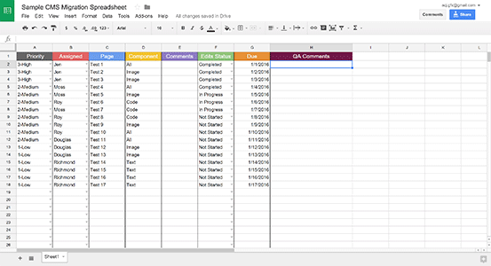
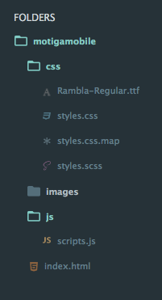

Like a zombie apocalypse, a CMS migration tests your adaptability under severe stress. The long hours, the multi-team collaboration, and the constant changes leave you feeling less than alive. Here are some tips to prevent the zombie transformation.
<!--preview-divider-->

## Prep Yourself
The most difficult part of any migration (or zombie attack) will be adapting to constant changes, from updating priorities to dynamic builds. Allow yourself to be flexible. Understand that priorities will shift and that some things are beyond your control. Going in with this mentality will save you and your team from unnecessary angst in the long run.

Clear team communication is also key in preventing future headaches. Make sure you have a project management and tracking system in place that everyone knows how to use - this can be done in Google Docs/Sheets (free), or using tools like Basecamp, Trello or Asana (subscription-based).

Here’s an example of a Google Sheet template our team used in a recent migration project:

Sample Spreadsheet

The use of collaborative platforms ensure teammates are aware of the current progress on migration-related items.

## Plan the Attack
Before diving into new the CMS, plan a method of attack. Decide team roles, tracking methods  (see the project management tips above), and milestones/deadlines.

Next, familiarize yourself with the CMS. Know what every button and component does. Understand the interface. Be sure to follow one rule through this process: **document everything**. Document your process and any difficulties you encounter along the way as well as any unique approaches you took to fix problems that arise (there will be problems). This way, you can build a handy reference document for current and future teams who work with the new system.

## Gather Resources
Folder Sample Example

At this point, outline what assets you and your team needs. By gathering your resources before starting any work, you create a more efficient workflow. Develop the folder system for both HTML files and assets. Decide what templates you need and the proper way to build them, component-wise. Update the documentation throughout this process with any progressions, including naming conventions, component jargon, or specialized builds. Finally, have a list of any custom pages. Divvy up the custom pages appropriately, whether that means assigning pages to the original creator, someone with more experience, or someone who has fewer pages than the rest of the team.

## Attack!

The hour arrives; it's time to tackle this migration. Throughout the migration, your tracking system will be your map. Start with a page that’s light on content and features to lessen any chance of feeling overwhelmed. Divide the page into evenly-weighted sections, reevaluating each section weight as needed. A section with three paragraphs may weigh as much as a section with two paragraphs, an image, and a call-to-action button. Estimate how long each section should take and stop when you reach that time. If any section takes longer than your estimated time, note the time difference and cause of the difference in the tracking system. This method will keep you productive and allow you to keep moving rather than getting stuck. You can come back to noted problems at the completion of a page or pass them off to a teammate.

When choosing which page to create next, aim for one that’s slightly harder that the last. Hold off on custom pages until you have a few completed 'regulars' under your belt. This way, you'll have a much broader arsenal of skills and shortcuts to work with when that time comes.

Maintain contact with your team as you conquer the zombie horde. Share tips and tricks you’ve discovered along the way in team meetings or shared documentation. Inform each other of known bugs. Always check your tracker for priority updates. Contact improves efficiency, efficiency improves workflow, and improved workflow increases overall progress.

## Conclusion

A migration, much like a zombie infection, pushes you to your limits. Be flexible and willing to adapt to an ever-changing environment. Realize that a migration is a team effort&mdash;no one ever survived an apocalypse alone.