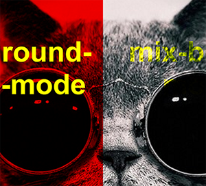

Although blend modes were initially born in the darkroom, Photoshop and the rise of widely available graphical editing software in the early 2000s pushed these techniques in new and experimental directions. <!--preview-divider-->Internet forums of the early aughts flooded the internet with small-scale, non-commercial graphics, leading to new micro-genres of art including that of user avatars and signatures. While the forum days are behind us, recent advances in HTML and CSS have once again brought blend modes into the picture for web designers itching to experiment with new technologies.

<a href="http://codepen.io/acjdesigns/pen/aJpmdx" class="post-img rail right"><span>Figure 1</span></a>

CSS3 reigns as the popular blend mode technique with web developers due to its relatively quick and simple implementation. With CSS3 blend modes, the developer chooses either **background-blend-mode** or **mix-blend-mode** followed by the type of blend mode they want to use. What do **background-blend-mode** and **mix-blend-mode** mean? **Background-blend-mode** takes advantage of the interaction between a background-image and a background-color through a <a href="http://codepen.io/acjdesigns/full/NGEjOL/" target="_blank">specified type of blend mode</a>. **Mix-blend-mode**, on the other hand, dictates how an HTML element interacts with the element "beneath" it, applying the styles to the element that is "on-top". In Figure 1, we notice on the left, the image shows, but appears red. This is an example of the **background-blend-mode**. On the right is the **mix-blend-mode**, where the image is opaque, but the text appears translucent.

With CSS3, there are *fifteen* blend mode values.  We can use <a href="http://photoblogstop.com/photoshop/photoshop-blend-modes-explained" target="_blank">Robert Thomas's grouping</a> as a base to divide the blend modes into understandable groups. As a base, we have the **normal** blend mode in its own category. The darken category emphasizes the dark colors of the image with the bottom layer in mind and contains the **multiply**, **darken**, and **color-burn** blend modes. Lighten does the reverse of darken, where the lighter colors are emphasized and include **lighten**, **screen**, and **color-dodge**. **Overlay**, **soft-light**, and **hard-light** fall under contrast and through different algorithms create different levels of contrast between the elements. <a href="http://photoblogstop.com/photoshop/photoshop-blend-modes-explained" target="_blank">Inversion</a> contains **difference** and **exclusion**, while **subtraction** and **divide** are considered <a href="http://photoblogstop.com/photoshop/photoshop-blend-modes-explained" target="_blank">cancellation</a> blend modes. The final group, called “component”, contains **hue**, **saturation**, **color**, and **luminosity** and keeps the specified value the same while adjusting the other component values. We can see blend modes in action <a href="http://codepen.io/acjdesigns/pen/NGEjOL" target="_blank">here</a>.

HTML5 canvas makes up the other side of web-based blend modes, though this concept is a bit of a misnomer. While initializing the canvas element may be done with HTML5, applying the blend mode requires JavaScript. We can see the application process in the example below:

```js
var test_canvas = document.createElement('canvas');
var ctx = test_canvas.getContext('2d');
ctx.globalCompositeOperation = 'multiply';
```

The code above shows that the browser creates a canvas element, gets the context, and then runs a <span class="pre">globalCompositeOperation</span> on the specified context. A <span class="pre">globalCompositeOperation</span> explains how a canvas draws an element to itself. Currently, HTML5 canvas has all the blend modes that CSS has, plus 11 more: **source-in**, **source-out**, **source-atop**, **source-over**, **destination-in**, **destination-out**, **destination-atop**, **destination-over**, **xor**, **copy**, and **lighter** and can be seen <a href="http://codepen.io/acjdesigns/pen/VpPPvE" target="_blank">here</a>.

CSS blend modes seem to be enough, so why use HTML5 canvas? Currently, <a href="http://caniuse.com/#search=css%20blend%20mode" target="_blank">browsers barely support CSS blend modes</a>, with Internet Explorer and Edge having zero support. Safari partially supports blend modes. Mobile support for CSS blend modes remains to be next to nil. HTML5 canvas, on the other hand, always supports <span class="pre">globalCompositeOperation</span>, which means as long as the browser supports HTML5 canvas, the browser supports <span class="pre">globalCompositeOperation</span>. This logic makes HTML5 canvas a suitable blend mode choice for the present.

Happy blending!

